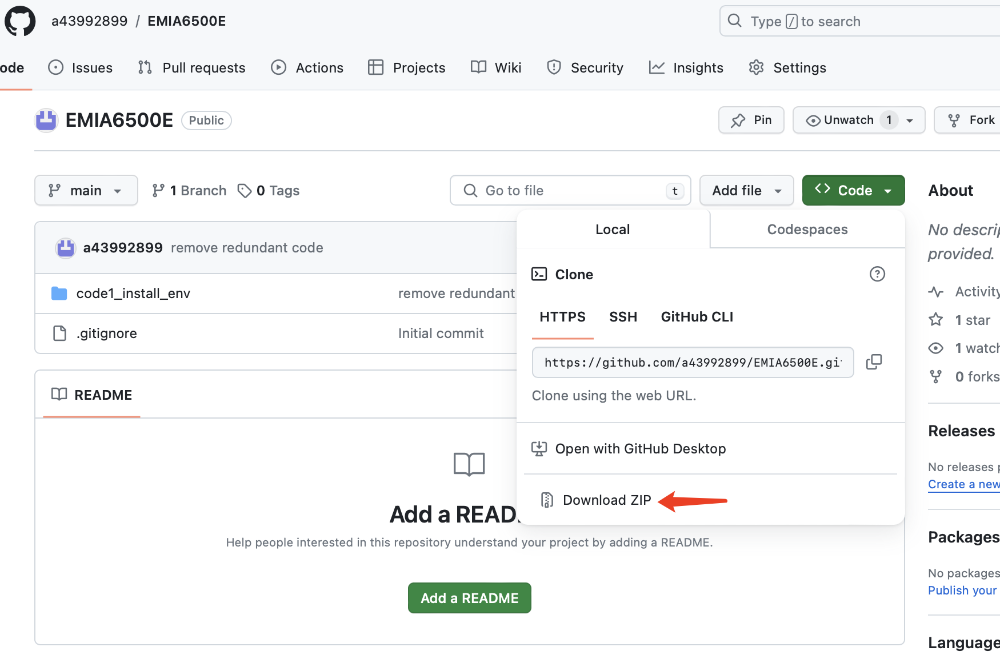

# Install vscode on mac
TAs are using Visual Studio Code to write and run Python code.
You can install Visual Studio Code on Mac by following the instructions on the [Visual Studio Code website](https://code.visualstudio.com/docs/setup/mac).

# Install Miniconda on Mac and Linux
You can refer to the [Miniconda installation guide](https://docs.anaconda.com/free/miniconda/) for more information.
If you don't know how to open a terminal, you can refer to the [Terminal on Mac](https://www.howtogeek.com/682770/how-to-open-the-terminal-on-a-mac/) guide.

To install Miniconda on a unix-based system, refer to the following steps. Since Mac and Linux are both unix-based systems, the installation process is almost the same.

If you are arm64 Mac user, you can run the following commands in the terminal:
```bash
mkdir -p ~/miniconda3
# arm64 is for M1 Macs
curl https://repo.anaconda.com/miniconda/Miniconda3-latest-MacOSX-arm64.sh -o ~/miniconda3/miniconda.sh
bash ~/miniconda3/miniconda.sh -b -u -p ~/miniconda3
rm -rf ~/miniconda3/miniconda.sh
```

If you are x86_64 Mac user, you can run the following commands in the terminal:
```bash
mkdir -p ~/miniconda3
# x86_64 is for Intel Macs
curl https://repo.anaconda.com/miniconda/Miniconda3-latest-MacOSX-x86_64.sh -o ~/miniconda3/miniconda.sh
bash ~/miniconda3/miniconda.sh -b -u -p ~/miniconda3
rm -rf ~/miniconda3/miniconda.sh
```

Linux users can install Miniconda by running the following commands in the terminal:
```bash
mkdir -p ~/miniconda3
wget https://repo.anaconda.com/miniconda/Miniconda3-latest-Linux-x86_64.sh -O ~/miniconda3/miniconda.sh
bash ~/miniconda3/miniconda.sh -b -u -p ~/miniconda3
rm -rf ~/miniconda3/miniconda.sh
```

After running the commands, all users can activate the base Miniconda environment by running the following command:
```bash
source ~/miniconda3/bin/activate
```

You can verify the installation by running the following command:
```bash
conda --version
```
It should display the version of Miniconda you installed. e.g.`conda 23.11.0`

# Download EMIA6500E Course Materials from Github
You should first download the course materials from the [course github](https://github.com/a43992899/EMIA6500E/tree/main).

If you know how to use git, you can clone the repository by running the following command:
```bash
mkdir ~/code
cd ~/code
git clone https://github.com/a43992899/EMIA6500E.git
```

If you don't know how to use git, you can download the repository as a zip file by clicking the green "Code" button.


If you want to install git, see this guide from GPT4. [Install git](https://chat.openai.com/share/66110a95-3b66-4352-ad70-a1a7c9627a17). There are also a lot of instructions if you search "install git on mac" or "install git on linux" on the internet.

From now on, we assume you have downloaded the course materials and extracted them to `~/code/EMIA6500E`.

Please note that we will update the github repository regularly as the course progresses. You should update your local repository regularly to get the latest course materials. If you are using git, you can run the following command to update your local repository:
```bash
PROJECT_ROOT=~/code/EMIA6500E
cd PROJECT_ROOT
git pull
```

If you are not using git, remember to download the latest zip file every week.

# Install EMIA6500E Environment
Every time you open a new terminal, remember to set the `PROJECT_ROOT` to the path where you extracted the course materials. e.g. `~/code/EMIA6500E`
```
PROJECT_ROOT=~/code/EMIA6500E
```
Now create a new miniconda environment called `emia6500` and install the `requirements.txt` by running the following command:
```bash
cd $PROJECT_ROOT/code1_install_env
conda create --name emia6500 python=3.8
conda activate emia6500
pip install -r requirements.txt
```

To test your package is correctly installed, you can run the following command:
```bash
source ~/miniconda3/bin/activate
conda activate emia6500
python3 verify_env.py
```

The output should look similar to this:
```bash
PyTorch version:  2.0.1
Numpy version:  1.26.3
Pandas version:  2.1.4
Seaborn version:  0.13.2
Matplotlib version:  3.8.2
Sklearn version:  1.3.2
success!
```

# Install Jupyter Notebook, Run the Pytorch Example
You should follow this to install `python` and `jupyter` extensions on vscode. See [Install Python and Jupyter extensions](https://www.alphr.com/vs-code-open-jupyter-notebook/)

Now you can open the example jupyter notebook by clicking the `code1_install_env/fit_quadratic.ipynb` file in vscode.

It is a minimal pytorch example applying stochastic gradient descent (SGD) to learn a quadratic function from some noisy data.

You can run the notebook by clicking the `Run Cell` button or pressing `Shift+Enter` on your keyboard.

You should get familiar with the notebook interface and the basic operations such as running a cell, adding a new cell, and deleting a cell.

You should also get familiar with the pytorch library and the basic operations such as creating a tensor, defining a model, and training a model.

If you have any questions, please try to ask ChatGPT first. If it does not fix your problem, you may open an issue on the course github repository, or ask the TAs during the office hours.

To open an issue on the course github repository, you can click the `Issues` tab and then click the `New issue` button. A quick link is [here](https://github.com/a43992899/EMIA6500E/issues).


